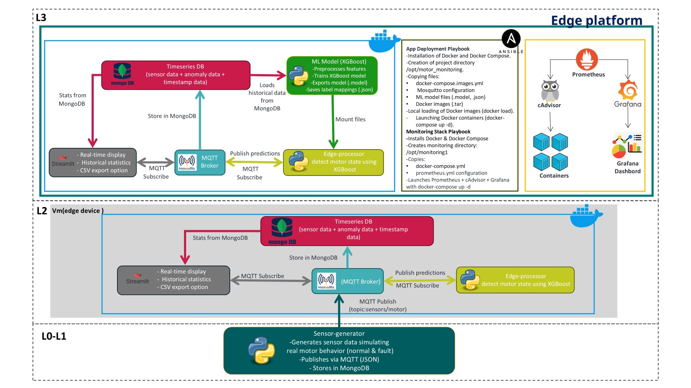
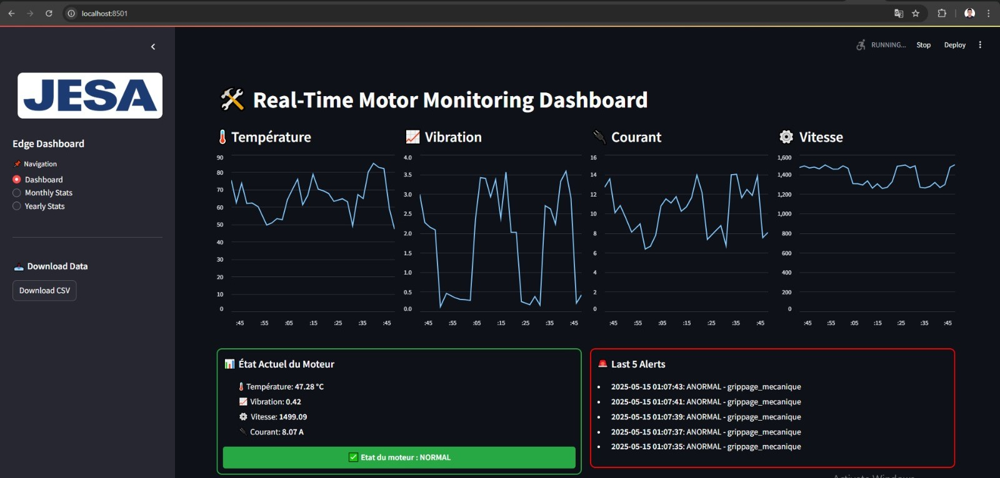
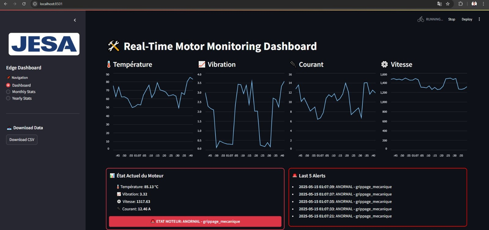

# edgeApp
**A cutting-edge application built with [Python, Streamlit, Mosquitto MQTT ]**
Welcome to our EdgeApp Project!
This repository contains the complete codebase of our Edge Computing App – edgeApp – designed to simulate, process, and visualize real-time sensor data.

EdgeApp leverages modern technologies such as Python, Docker, MQTT, and Streamlit to deliver a scalable and extensible solution for edge data processing. The app is containerized for easy deployment and built with performance and modularity in mind.

In this project, we’ve applied edge computing principles to simulate a sensor data, process it at the edge using Python services, and visualize the results in real-time through an intuitive Streamlit dashboard. Our aim is to offer a smooth, responsive, and insightful interface for monitoring and analyzing data closer to its source.

## 🧠 Why Edge Computing?
Edge computing processes data closer to the source, reducing latency and bandwidth usage. This project helps simulate and understand edge app architecture.

## 🧩 Architecture Diagram


## 📦 Components Description
    - Sensor Generator: Publishes real-time data to the MQTT broker.
    - Mosquitto: MQTT broker used for message transport.
    - Edge Processor: Subscribes to topics, processes incoming data using ML model.
    - Streamlit Dashboard: Visualizes the data with charts and giving ability to download data as csv files.


## 🧰 Technologies

- Python
- Docker & Docker Compose
- MQTT (Mosquitto)
- Streamlit
- Ansible (for automation and provisioning)
- Machine Learning 

## 📁 Project Structure
    edgeApp/
    ├── edge_processor/ # Processes incoming sensor data
    ├── model/ # Placeholder for ML models
    ├── mosquitto/ # MQTT broker config
    ├── sensor_generator/ # Simulates sensor data
    ├── streamlit_dashboard/ # Streamlit app for visualization
    └── docker-compose.yml # Docker Compose file

## ⚙️ Prerequisites

- Docker installed on your system: [Install Docker](https://www.docker.com/get-started)
- Docker Compose: [Install Docker Compose](https://docs.docker.com/compose/install/)
- MongoDB (local or cloud)
- SSH access to VMs
- Ansible installed on your host machine


## 🚀 Getting Started
This section will guide you through the steps to get the edgeApp up
and running on your local machine or server.

### Installation & Configuration
### 1. Cloning the Repository

__First, clone the edgeApp repository to your local machine:__
```
git clone
https://github.com/beloussama/edgeApp.git
```
__Go To The folder__
```
cd edgeApp
```
### 2. 🔐 Generate SSH Keys (if needed)

Before using Ansible to deploy or interact with VMs, make sure:

__You have generated a public/private key pair:__

```
ssh-keygen -t rsa -b 4096 -C "your_email@example.com"
```

> Note:
> After generating the key, add the public key (~/.ssh/id_rsa.pub) to the ~/.ssh/authorized_keys file on the VM.
> Ensure the following requirements are properly configured on the VM to allow SSH access:
> __OpenSSH Server is installed:__
>```
> sudo apt update
>sudo apt install openssh-server
>```
>__SSH service is running and enabled:__
>```
> sudo systemctl enable ssh
>sudo systemctl start ssh
>sudo systemctl status ssh
>```
>__Correct file permissions (critical for SSH to work securely):__
> ```
> chmod 700 ~/.ssh
> chmod 600 ~/.ssh/authorized_keys
> ```
> __Port 22 is open on the firewall (if UFW or firewalld is enabled):__
>```
> sudo ufw allow ssh
>sudo ufw enable
>```
>__You are logging in with the correct user and IP:__
> ```
> ssh your_user@your_vm_ip
> ```

__Make sure the private key path is correctly defined in the inventory.ini file (example below).__

```
[vmhosts]
ipadresstoVM ansible_user=VmUser ansible_ssh_private_key_file=/home/pathToPrivateKey
```

### 3. 🧾 MongoDB Configuration
Update the MongoDB URI in  
 - model/model.py line 10
 - sensor_generator/sensor_generator_mqtt.py  line 16
 - streamlit_dashboard/app.py line 24

### Build and run all services:

__Inside your terminal run__

```
docker-compose up --build
```

> Note: Make sure your docker engine is running 

## Access the Streamlit Dashboard:

__Open your browser and go to__
```
http://localhost:8501
```
You should see the live dashboard visualizing the sensor data (example below).



## 🛠️ Automation Deploy
### Ansible Setup
Ansible is used in this project to automate the setup and deployment process, ensuring consistency and repeatability across environments.

### 📦 What Ansible Does Here:
- Sets up Docker and required dependencies
- Pulls and runs Docker images for each service
- Configures network and environment variables

### ▶️ Running Ansible Playbook
### 1. Install Ansible on your local machine:
```
sudo apt update
sudo apt install ansible -y
```
### 2. Navigate to the Ansible directory
```
cd ansible
```
### 3. Run the playbook to set up the environment and start the edgeApp services:
```
ANSIBLE_INVENTORY=inventory.ini ansible-playbook -i inventory.ini deploy.yml
```
> Note: Run this commandes on your WSL Terminal


## 🤝 Contributing
Pull requests are welcome! Feel free to fork this repo and improve it.


> Note: Please refer to the project documentation for detailed instructions on setting up and running the application. Feel free to reach out to us with any questions or feedback.

Happy exploring and thank you for your interest in our edgeApp!
